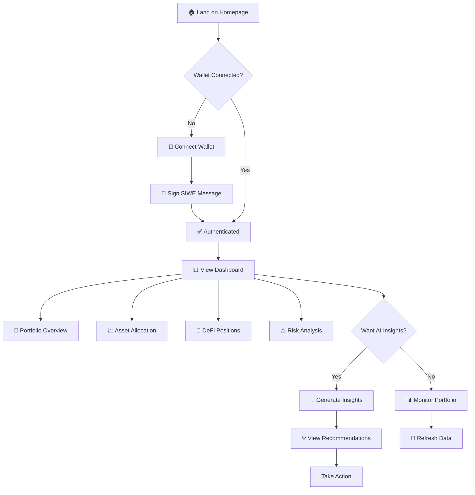
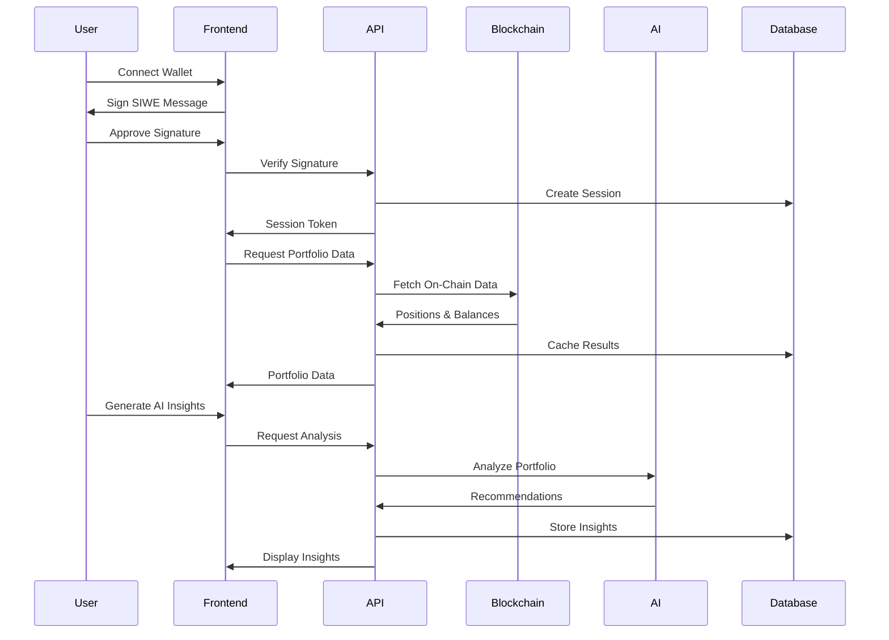
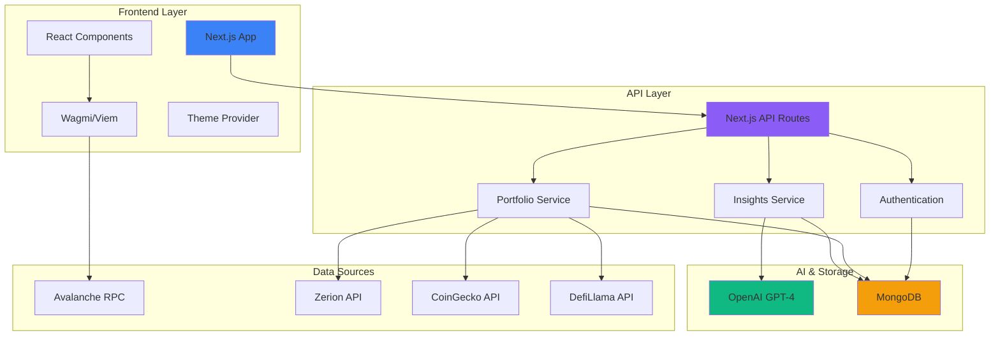
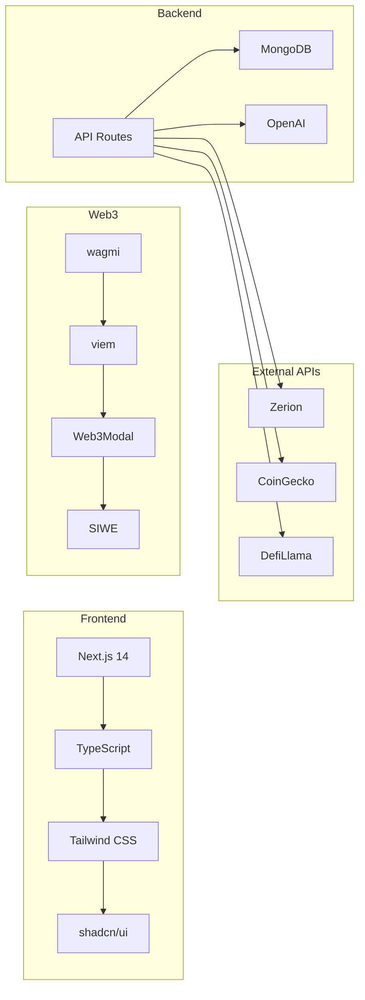
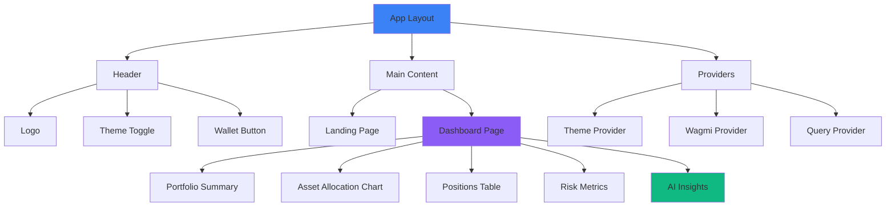

# Avax Ledger 🏔️

> **Your AI-powered DeFi portfolio companion for Avalanche**

Track, analyze, and optimize your Avalanche DeFi positions with real-time insights and AI-powered recommendations—all in one beautiful dashboard.

[](https://opensource.org/licenses/MIT)
[](https://www.typescriptlang.org/)
[](https://nextjs.org/)
[](https://www.avax.network/)

---

## 🎯 Why Avax Ledger?

Managing DeFi positions across multiple protocols is **complex**. You're juggling positions on Trader Joe, Benqi, Aave, GMX—tracking yields, monitoring risks, and trying to optimize returns.

**Avax Ledger solves this:**
- ✅ **One Dashboard** - All your Avalanche DeFi positions in one place
- ✅ **Real-Time Tracking** - Live portfolio values and performance metrics
- ✅ **AI-Powered Insights** - GPT-4 analyzes your portfolio and suggests optimizations
- ✅ **Risk Management** - Understand your exposure and diversification
- ✅ **Beautiful UX** - Intuitive interface that makes complex data simple

---

## 🚀 Quick Start

### 1. Clone & Install
```bash
git clone https://github.com/your-org/avax-ledger.git
cd avax-ledger
npm install
```

### 2. Configure Environment
```bash
cp .env.example .env
```

Edit `.env` with your keys:
```env
# Required for AI insights
OPENAI_API_KEY=sk-proj-...

# Required for wallet connection
NEXT_PUBLIC_WALLET_CONNECT_PROJECT_ID=your_project_id

# Optional: MongoDB for data persistence
MONGODB_URI=mongodb://localhost:27017/avax-ledger
```

### 3. Launch
```bash
npm run dev
```

Open [http://localhost:3000](http://localhost:3000) 🎉

**Note**: The app works with mock data by default—perfect for testing without API keys!

---

## 💡 How It Works

### User Flow



### What Happens Behind the Scenes



---

## 🏗️ Architecture

### System Overview



### Tech Stack



### Component Architecture



---

## 🎨 Features

### 📊 Portfolio Dashboard
- **Real-time value tracking** with 24h/7d performance
- **Asset allocation visualization** with interactive pie charts
- **DeFi positions overview** across all protocols
- **Performance metrics** and historical analysis

### 🤖 AI-Powered Insights
- **Opportunity Detection**: Find high-yield strategies
- **Risk Warnings**: Identify concentration and volatility risks
- **Rebalancing Suggestions**: Optimize your portfolio allocation
- **Impact Calculations**: Quantified outcomes for recommendations

### 🔐 Secure Authentication
- **Sign-In with Ethereum (SIWE)** standard
- **Session management** with iron-session
- **Network validation** for Avalanche C-Chain
- **Multiple wallet support**: MetaMask, WalletConnect, Coinbase

### 📈 Risk Analysis
- **Risk Score**: 0-100 scale with color-coded indicators
- **Diversification Analysis**: Portfolio concentration metrics
- **Volatility Tracking**: Price movement monitoring
- **Protocol Exposure**: DeFi risk assessment

### 🎯 Beautiful UX
- **Dark/Light mode** with system preference detection
- **Responsive design** for mobile, tablet, and desktop
- **Loading states** with skeleton placeholders
- **Toast notifications** for all actions
- **WCAG AA accessible** with keyboard navigation

---

## 📖 User Guide

### Getting Started

1. **Visit Homepage** → Click "Connect Wallet"
2. **Choose Your Wallet** → MetaMask, WalletConnect, etc.
3. **Sign Message** → Authenticate with SIWE
4. **View Dashboard** → See your portfolio automatically loaded
5. **Generate Insights** → Click "Generate Insights" for AI analysis

### Understanding Your Dashboard

#### Portfolio Summary Card
- **Total Value**: Your entire portfolio in USD
- **24h/7d Change**: Performance indicators with trend arrows
- **Token Count**: Number of unique assets

#### Asset Allocation Chart
- **Pie chart** showing distribution of holdings
- **Hover** for detailed breakdowns
- **Top 5 assets** plus "Other" grouping

#### Positions Table
- **Protocol**: Where your assets are deployed
- **Type**: Staked, Lending, Liquidity, or Farming
- **Value**: USD value of each position
- **APR/APY**: Current yield rates

#### Risk Metrics
- **Overall Risk**: Low (green), Medium (yellow), High (red)
- **Diversification Score**: How spread out your holdings are
- **Volatility**: Based on 24h price movements

#### AI Insights
- **🟢 Opportunities**: Growth and yield strategies
- **🔴 Risk Warnings**: Issues to address
- **🔵 Rebalancing**: Optimization suggestions
- **Impact**: Expected outcomes

---

## 🛠️ Development

### Project Structure
```
avax-ledger/
├── apps/web/              # Next.js application
│   ├── app/               # Pages and API routes
│   ├── components/        # React components
│   ├── hooks/             # Custom hooks
│   └── lib/               # Utilities
├── packages/
│   ├── types/             # Shared TypeScript types
│   ├── utils/             # Shared utilities
│   └── config/            # Configuration
├── services/
│   ├── portfolio/         # Portfolio aggregation
│   └── insights/          # AI insights generation
└── infrastructure/
    └── mongodb/           # Database schemas
```

### Available Commands
```bash
npm run dev          # Start development server
npm run build        # Build for production
npm run start        # Start production server
npm run lint         # Run ESLint
npm run type-check   # Check TypeScript types
```

### Key Technologies
- **Frontend**: Next.js 14, React 18, TypeScript, Tailwind CSS
- **UI**: shadcn/ui, Radix UI, Recharts, Lucide Icons
- **Web3**: wagmi, viem, Web3Modal, SIWE
- **Backend**: Next.js API Routes, MongoDB, Mongoose
- **AI**: OpenAI GPT-4
- **APIs**: Zerion, CoinGecko, DefiLlama

---

## 🔒 Security & Privacy

- ✅ **No private keys stored** - We never have access to your wallet
- ✅ **SIWE authentication** - Industry standard for Web3 login
- ✅ **Secure sessions** - iron-session with encrypted cookies
- ✅ **Read-only access** - We only read your public on-chain data
- ✅ **No transaction signing** - You control all transactions

---

## 🚢 Deployment

### Deploy to Vercel (Recommended)

1. **Push to GitHub**
   ```bash
   git push origin main
   ```

2. **Import to Vercel**
   - Go to [vercel.com](https://vercel.com)
   - Click "Import Project"
   - Select your repository

3. **Configure**
   - Set root directory: `apps/web`
   - Add environment variables from `.env`

4. **Deploy** 🚀

### Other Platforms
Works on: Netlify, Railway, AWS Amplify, self-hosted with PM2

---

## 🗺️ Roadmap

### ✅ Phase 1: Foundation (Complete)
- [x] Wallet integration with SIWE
- [x] Portfolio dashboard
- [x] AI insights generation
- [x] Risk analysis
- [x] Responsive design

### 🚧 Phase 2: Enhancement (In Progress)
- [ ] Historical performance charts
- [ ] Transaction history
- [ ] Multi-chain support (Ethereum, BSC)
- [ ] Portfolio export (CSV/PDF)

### 📅 Phase 3: Advanced Features (Planned)
- [ ] What-if simulator
- [ ] Push notifications
- [ ] Mobile app (React Native)
- [ ] Social features (share insights)
- [ ] Advanced analytics

---

## 🤝 Contributing

We welcome contributions! Here's how:

1. **Fork** the repository
2. **Create** a feature branch (`git checkout -b feature/amazing-feature`)
3. **Commit** your changes (`git commit -m 'Add amazing feature'`)
4. **Push** to the branch (`git push origin feature/amazing-feature`)
5. **Open** a Pull Request

See [CONTRIBUTING.md](./CONTRIBUTING.md) for detailed guidelines.

---

## 📄 Documentation

- **[Getting Started Guide](./GETTING_STARTED.md)** - Complete setup instructions
- **[Wallet Integration](./WALLET_INTEGRATION.md)** - Web3 authentication details
- **[Dashboard Components](./apps/web/components/dashboard/README.md)** - Component docs
- **[Architecture](./ARCHITECTURE.md)** - System design details
- **[Responsive Design](./RESPONSIVE_DESIGN_IMPROVEMENTS.md)** - Mobile optimization

---

## 💬 Support & Community

- 📖 **Documentation**: [docs.avax-ledger.com](https://docs.avax-ledger.com) *(coming soon)*
- 🐛 **Bug Reports**: [GitHub Issues](https://github.com/your-org/avax-ledger/issues)
- 💡 **Feature Requests**: [GitHub Discussions](https://github.com/your-org/avax-ledger/discussions)
- 💬 **Community**: [Discord](https://discord.gg/avax-ledger) *(coming soon)*
- 🐦 **Updates**: [@AvaxLedger](https://twitter.com/AvaxLedger) *(coming soon)*

---

## 📊 Status


**Current Version**: 0.1.0 (Beta)

- ✅ Core features implemented
- ✅ UI/UX polished and responsive
- ✅ Mock data for development
- 🚧 Real API integration in progress
- 📅 Production release: Q2 2024

---

## 🙏 Acknowledgments

Built with incredible tools from:
- **Avalanche** - Fast, low-cost blockchain infrastructure
- **OpenAI** - GPT-4 for AI-powered insights
- **Vercel** - Next.js and deployment platform
- **shadcn** - Beautiful UI component library
- **wagmi** - React hooks for Ethereum
- **Zerion, CoinGecko, DefiLlama** - DeFi data APIs

Special thanks to the Avalanche and Web3 communities! 🙏

---

## 📜 License

MIT License - see [LICENSE](./LICENSE) for details.

---

## ⭐ Show Your Support

If you find Avax Ledger useful, please consider:
- ⭐ **Starring** the repository
- 🐦 **Sharing** on Twitter
- 🤝 **Contributing** to the project
- 💬 **Spreading the word** in the community

---

**Built with ❤️ for the Avalanche DeFi community**

*Track smarter. Invest better. Earn more.* 🚀

